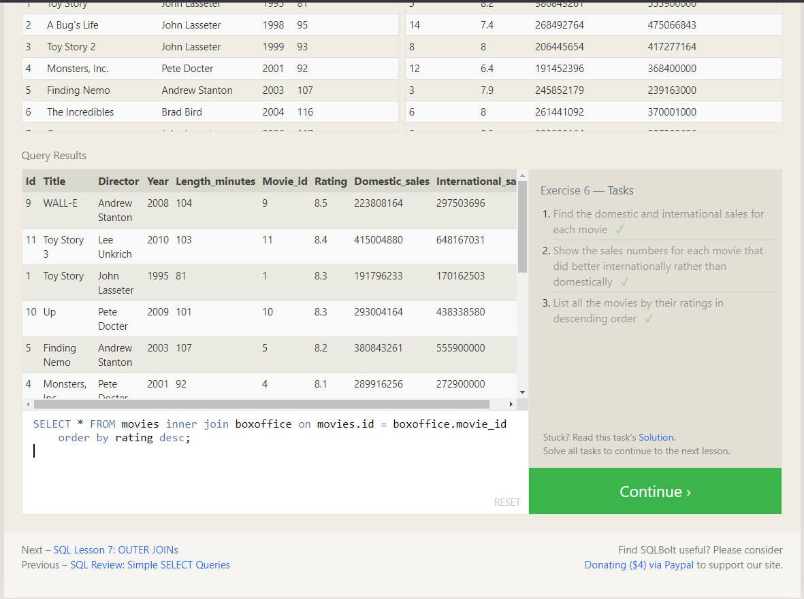
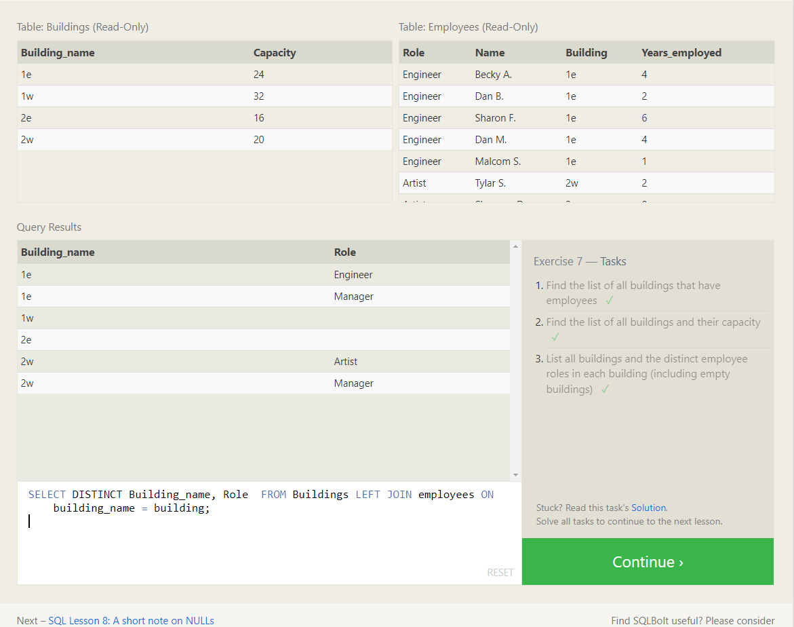

# Summary: SQL (Structured Query Language)

SQL, short for Structured Query Language, is a powerful language used for managing and interacting with relational databases. It allows users to perform various operations on the database, such as retrieving, inserting, updating, and deleting data.

## Key Concepts

1. **Tables:** Relational databases organize data into tables, where each row represents a record, and each column represents an attribute.

## Common SQL Commands

- `SELECT`: Retrieves data from one or more tables based on specified conditions.

- `INSERT`: Adds new records to a table.

- `UPDATE`: Modifies existing records in a table.

- `DELETE`: Removes records from a table based on specified conditions.

- `JOIN`: Combines data from two or more tables based on a related column.

- `WHERE`: Filters data based on specified conditions.

